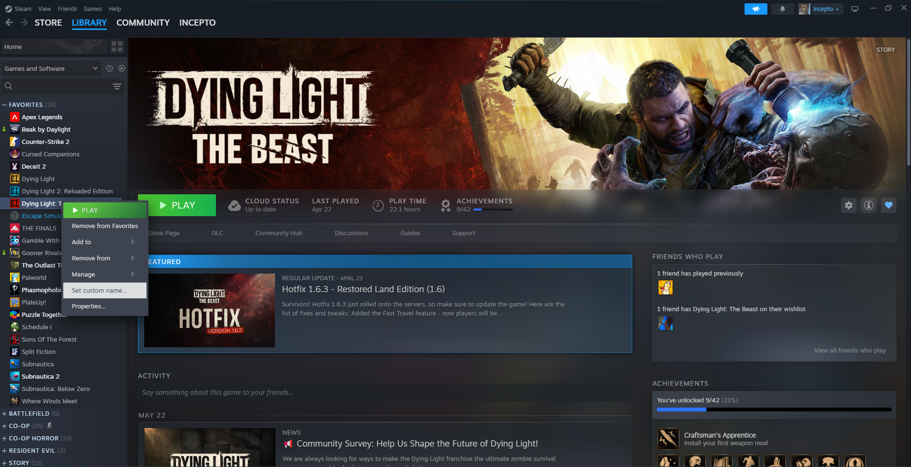
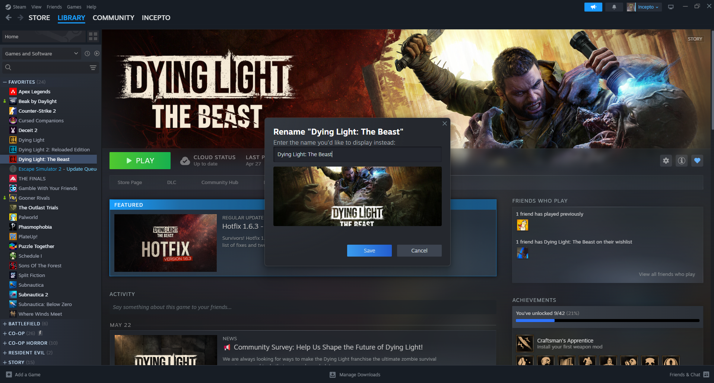
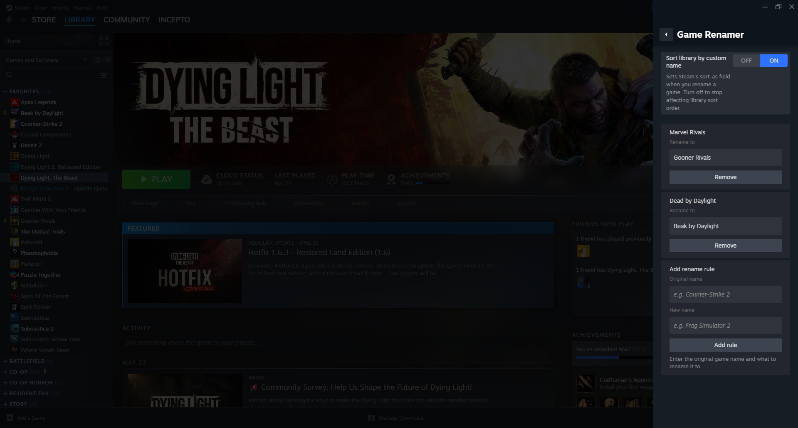

# Game Renamer for Millennium

A Millennium plugin that lets you rename games in your Steam library with custom display names, without affecting your actual game files or Steam data.

## 📋 Prerequisites

Before installing this plugin, ensure you have:

-   **[Millennium](https://steambrew.app/)** installed and configured

### Images





---

## 🚀 Installation Guide

### Method 1: Build from Source

#### Step 1: Clone the Repository

```bash
git clone https://github.com/Inceptofn/Steam-GameRenamer-Plugin.git
cd Steam-GameRenamer-Plugin
```

#### Step 2: Install Dependencies

```bash
pnpm install
```

#### Step 3: Build the Plugin

**For development (auto-rebuilds on changes):**

```bash
pnpm run dev
```

**For production:**

```bash
pnpm run build
```

#### Step 4: Install to Steam

**Copy to plugins directory**

```bash
# Windows
xcopy /E /I . "C:\Program Files (x86)\Steam\plugins\steam-game-renamer"
```

#### Step 5: Enable Plugin in Steam

1. Completely close Steam (including system tray)
2. Restart Steam
3. Go to **Millennium** → **Plugins**
4. Enable "Game Renamer"
5. Restart Steam once more

---

## 🔗 Links

-   [Millennium Framework](https://github.com/SteamClientHomebrew/Millennium)
-   [Steam Client](https://store.steampowered.com/about/)
